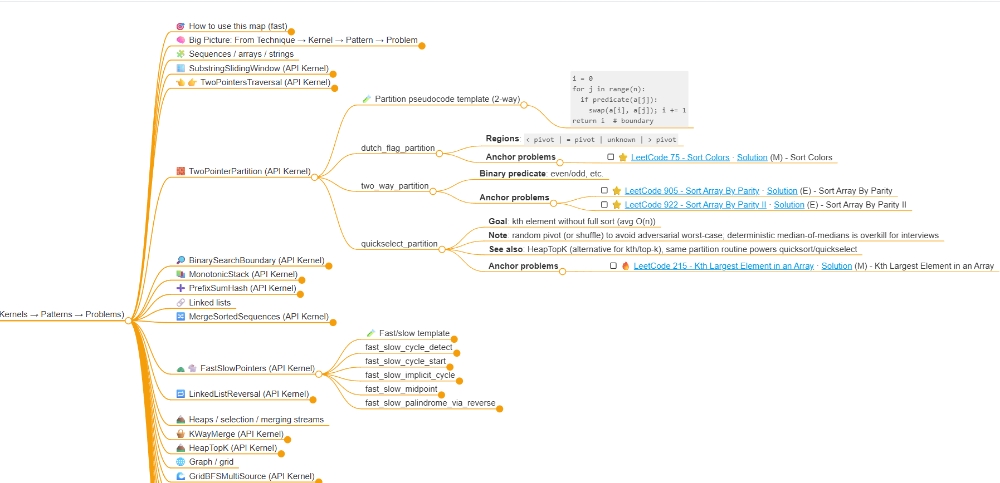

# NeetCode 練習框架

[](https://github.com/lufftw/neetcode/stargazers)
[](https://www.python.org/)
[](LICENSE)

**解題。遺忘。重複。讓我們打破這個循環。**

> *「精通演算法不是死背 300 道題 — 而是內化 15 個核心模式。」*

---

## 看見全貌

[](https://lufftw.github.io/neetcode/pages/mindmaps/neetcode-ontology-agent-evolved-zh-tw.html)

我們的 AI 生成心智圖揭示模式之間的關聯 — 這些關係需要多年才能自己內化。

[](https://lufftw.github.io/neetcode/pages/mindmaps/neetcode-ontology-agent-evolved-zh-tw.html)

[English](https://lufftw.github.io/neetcode/pages/mindmaps/neetcode-ontology-agent-evolved-en.html) · [繁體中文](https://lufftw.github.io/neetcode/pages/mindmaps/neetcode-ontology-agent-evolved-zh-tw.html) · [所有心智圖 →](https://lufftw.github.io/neetcode/mindmaps/)

---

## 我們的獨特之處

### 1. 雙軌模式學習

每個模式都有**兩種互補的指南**：

- **💡 直覺篇** — 透過故事和視覺比喻理解*為什麼*
- **🛠️ 模板篇** — 面試用的生產級程式碼與快速參考

[Sliding Window](docs/patterns/sliding_window/) 的範例：

> *「視窗是一個移動的注意力透鏡 — 它遺忘過去，專注於當下重要的事。」*
>
> 每個滑動視窗演算法都是兩股力量的舞蹈：**探索者**（右指標）發現新領域，而**守門人**（左指標）維護有效性。

這不只是另一個解答收藏。這是一個建立**可遷移直覺**的系統。

### 2. 生產級測試

你的解法通過了 LeetCode。但它*正確*嗎？它*最優*嗎？

**比較多種方法：**

```bash
python runner/test_runner.py 0215_kth_largest --all --benchmark
```

```
╔════════════════════════════════════════════════════╗
║ 0215_kth_largest_element_in_an_array - Performance ║
╠════════════════════════════════════════════════════╣
║ default:     ████████████████████  114ms           ║
║ quickselect: ████████████████░░░░   96ms           ║
║ heap:        ██████████████████░░  107ms           ║
╚════════════════════════════════════════════════════╝

Method         Avg Time   Pass Rate  Complexity
-----------  ----------  ----------  --------------------
default        113.51ms         3/3  O(n) average time, O(1) space
quickselect     96.06ms         3/3  O(n) average time, O(1) space
heap           107.34ms         3/3  O(n log k) time, O(k) space
```

**看看演算法複雜度為何重要：**

```bash
python runner/test_runner.py 0011_container --all --estimate
```

| n | O(n) Two Pointers | O(n²) Brute Force | 加速比 |
|--:|------------------:|------------------:|-------:|
| 500 | 0.27ms | 554ms | **2,052x** |
| 1000 | 0.52ms | 2,544ms | **4,892x** |
| 5000 | 2.78ms | 68,291ms | **24,565x** |

當 n=5000 時，O(n) 演算法在 **3ms** 內完成，而 O(n²) 需要 **68 秒**。

> 📖 [更多範例與解讀指南 →](docs/runner/README.md#examples-gallery)

**自動儲存失敗案例以便除錯：**

```
gen_3: ❌ FAIL [generated]
   ┌─ Input ─────────────────────────────────
   │ [1,3,5,7]
   │ [2,4,6,8]
   ├─ Actual ────────────────────────────────
   │ 4.5
   └─────────────────────────────────────────
   💾 Saved to: tests/0004_failed_1.in
```

**更多功能：**
- 帶 Seed 隨機生成，可重現的壓力測試
- 自訂 Judge 函式處理多重正確答案
- 記憶體分析與火花線視覺化

### 3. AI 驅動的知識圖譜

我們建立了互聯的本體論：**API 核心 → 模式 → 問題家族**。

AI 分析這個結構，生成人類可能遺漏的洞見 — 綜合架構師、教授、工程師與競賽選手的多重視角。

---

## 快速開始

### 1. 環境設置

```bash
# Clone 並設置
git clone https://github.com/lufftw/neetcode.git
cd neetcode

# 建立虛擬環境 (Python 3.11)
python -m venv leetcode
leetcode\Scripts\activate  # Windows
source leetcode/bin/activate  # Linux/macOS

# 安裝依賴
pip install -r requirements.txt
```

### 2. 建立題目

```bash
scripts\new_problem.bat 1 --with-tests  # Windows
./scripts/new_problem.sh 1 --with-tests  # Linux/macOS
```

### 3. 執行測試

```bash
python runner/test_runner.py 0001_two_sum
```

**就這樣。** 在 VS Code 按 `F5` 除錯，或 `Ctrl+Shift+B` 執行所有測試。

---

## 模式指南

每個模式提供直覺篇 + 模板篇。先從直覺開始，面試時用模板。

| 模式 | 直覺 | 模板 | 範例題目 |
|:-----|:----:|:----:|:---------|
| Sliding Window | [💡](docs/patterns/sliding_window/intuition.md) | [🛠️](docs/patterns/sliding_window/templates.md) | LC 3, 76, 209, 239, 340, 438, 567 |
| Two Pointers | [💡](docs/patterns/two_pointers/intuition.md) | [🛠️](docs/patterns/two_pointers/templates.md) | LC 11, 15, 16, 26, 27, 75, 80, 88, 125, 141, 142, 167, 202, 283, 287, 876, 977 |
| Binary Search | [💡](docs/patterns/binary_search/intuition.md) | [🛠️](docs/patterns/binary_search/templates.md) | LC 4, 33, 34, 35, 81, 162, 875, 1011 |
| Backtracking | [💡](docs/patterns/backtracking_exploration/intuition.md) | [🛠️](docs/patterns/backtracking_exploration/templates.md) | LC 39, 40, 46, 47, 51, 52, 77, 78, 79, 90, 93, 131, 216 |
| Monotonic Stack | [💡](docs/patterns/monotonic_stack/intuition.md) | [🛠️](docs/patterns/monotonic_stack/templates.md) | LC 42, 84, 85, 316, 402, 496, 503, 739, 901, 907 |
| Dynamic Programming | [💡](docs/patterns/dp_1d_linear/intuition.md) | [🛠️](docs/patterns/dp_1d_linear/templates.md) | LC 70, 72, 121, 198, 213, 322, 416, 494, 516, 518, 746 |
| Graph Traversal | [💡](docs/patterns/graph/intuition.md) | [🛠️](docs/patterns/graph/templates.md) | LC 133, 200, 207, 210, 286, 417, 542, 547, 743, 785, 787, 802, 841, 994, 1631 |
| Tree Traversal | [💡](docs/patterns/tree/intuition.md) | [🛠️](docs/patterns/tree/templates.md) | LC 94, 102, 104, 110, 124, 337, 543, 968 |

**[查看全部 25+ 模式 →](docs/patterns/README.md)**

---

## 功能一覽

| 類別 | 功能 |
|:-----|:-----|
| **測試** | 隨機生成、自訂 Judge、壓力測試、複雜度估算 |
| **學習** | 模式直覺指南、可重用模板、雙軌文件 |
| **視覺化** | AI 心智圖、模式層級、問題關聯 |
| **工具** | VS Code 整合、一鍵建立骨架、效能基準 |

---

## 文件

### 入門指南

| 文件 | 說明 |
|:-----|:-----|
| [建立新題目](docs/guides/new-problem.md) | 如何建立題目骨架 |
| [解法規範](docs/contracts/solution-contract.md) | 解法檔案格式與要求 |
| [測試檔案格式](docs/contracts/test-file-format.md) | 如何撰寫 `.in/.out` 測試檔案 |

### 學習資源

| 文件 | 說明 |
|:-----|:-----|
| [模式指南](docs/patterns/README.md) | 全部 25+ 模式的直覺篇 + 模板篇 |
| [測試執行器](docs/runner/README.md) | 測試、效能基準與驗證 |

### 進階主題

| 文件 | 說明 |
|:-----|:-----|
| [生成器規範](docs/contracts/generator-contract.md) | 隨機測試生成與壓力測試 |

---

## 貢獻

歡迎貢獻！請參閱 [貢獻者指南](docs/contributors/README.md)。

```bash
# 執行單元測試
python -m pytest .dev/tests -v
```

---

## 授權

MIT License — 可自由用於個人學習與教育用途。

---

<p align="center">
  <b>為想要理解、而非只是記憶的學習者而建。</b>
</p>

[📚 文件](https://lufftw.github.io/neetcode/) · [🧠 心智圖](https://lufftw.github.io/neetcode/mindmaps/) · [📐 模式](docs/patterns/README.md) · [🧪 測試](docs/runner/README.md)
